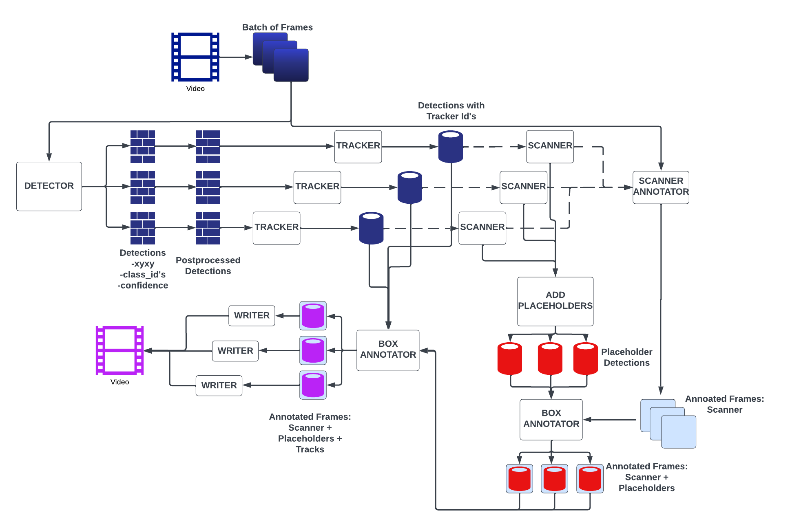

# SOLUTION REPORT 

## Final Solution:
We recommend looking at the flow chart provided below, alongside the description.
### Data
- Add images from stage 1, specifically from the Regensburg plant as background images.
- Used stage_1/transform_data.py to convert the data to the yolov5 format. And the fifyone library to convert from yolov5 to COCO format.
### Detection
 - Use PaddleDetection library for state of the art object detection, that run under Apache 2.0 Licence
 - As detector use PP-YOLOE + architecture. The size m, to be specific.
- Source <https://github.com/PaddlePaddle/PaddleDetection>
- The model was trained on the Nvidia Cluster with an A100(80GB) GPU for 150 epochs, approximately 45 hours. Used the standard data augmentation provided by the PaddleDetection framework (resizing, mosaic etc.). Input training size was 800x800 pixels, with a batch size of 24.
 
- The trained model is to be found in the model/ folder.

### Tracking
- Use ByteTrack as a strong and fast tracking algorithm. Runs under MIT licence.
- Source <https://github.com/ifzhang/ByteTrack>

### Scanning

## Workflow
### Postprocess: (initial_results_to_detections())
    - Instantiate a Detections class containing the information of the detections of the frame(detections/detection_utils.py)
    - Remove all detections with center of boxes below 600 pixels
    - Remove all detections with an bounding box area of less than 2500
    - Remove all rack detections with a confidence less than 0.75 
    - Remove all box detecitons with a confidence of less than 0.35
### Tracks: (get_tracks())
    - feeds the tracker the detections
    - matches the detectoins with the tracks to receive tracker ids for detections
    - adds the tracker ids to the Detections instance
    - filter out all detections that do not have a tracker id

### Add placeholders:(core to be found in detections/detection_tools.py get_placeholders_for_racks())
    - Takes all the rack detections that are left to the scanner. Looks up the relative coordinates of all possible klts relative to the rack detection bounding box.
    - Generates all possible klts boxes of that specific rack. 
    - Removes all new klt boxes that have an IoU with the actual detected boxes of greater than 0.25. 
    - Returns a seperable Detections instance with all the possible placeholders.
    - Uses box annotator to annotate the placeholders in the frames

### Scanning the boxes: (scanner.update(), found in tracking/rack_counter.py)

    - The scanner can be imagined by a vertical line 
##  process_video() flow chart:

## Run the solution:
- we reommend the stage2.ipynb for running. 
- Install the needed packages
- Transform your dataset into COCO format
- In PaddleDetecion/configs/datasets/ add a yml file for your dataset
- In /PaddleDetection/configs/ppyoloe/ppyoloe_plus_crn_m_80e_coco.yml change to your dataset file you just added.
- In the notebook or main.py you see the necessary constants you need to choose and for running the script simply instantiate a VideoProcessor class and run the process_video method.

The README file is your solution report, and would include your solution approach and description, overall model architecture, framework, implementation techniques, hardware, transfer learning, used tools, training time, license file, any other technical details you would like to emphasize and highlight... And of course, how to run the solution, and your trained model!
